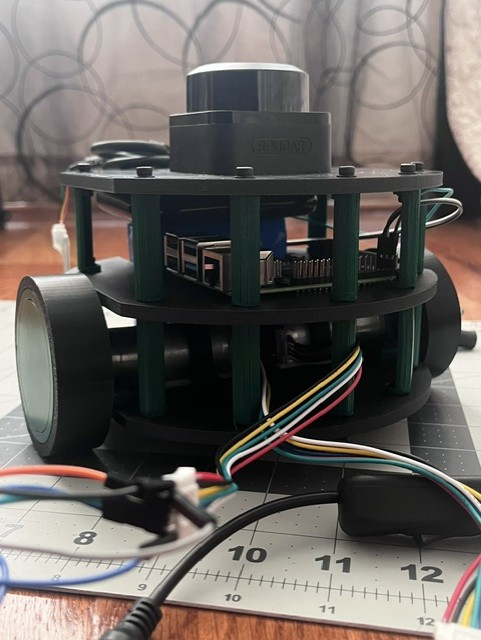
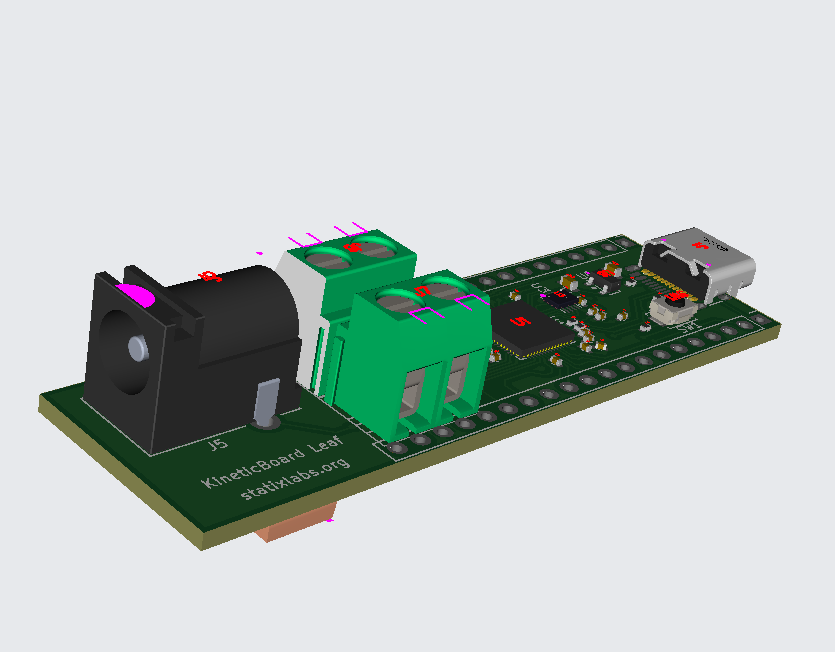
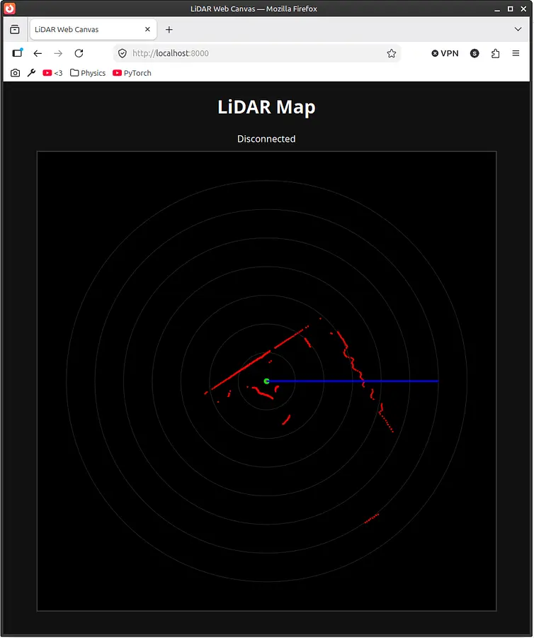

# Colosseus
**A simplified robotics platform for students K-12.**

*This project is still in a very early stage; take caution during the initial assembly. Be careful while operating the KineticBoard Leaf 0 because it can induce electric shock if not properly soldered.*

## What's Colosseus?
Colosseus is designed to be a two-wheeled robot that is easy to program and to learn. Its main feature is its stackable design, allowing more and more boards, often called "levels", to be added on top of it like pancakes. The demo version of Colosseus, which is featured in this repo, comes with a lidar as the main sensor on top.

## Repository Structure
The folders `Chassis` and `KineticBoard-Leaf` pertain to the M-CAD/E-CAD portions of this project, respectively. `KBLController` contains firmware for the KineticBoard Leaf microcontroller, which needs to be converted into a `.uf2` format by a `gcc-arm-none-eabi` cross-compiler. `Software` is an umbrella folder for the various software components for the Pi 4, but everything is neatly packaged into a Docker container for a quick and easy installation.

## What's Inside?
- **Raspberry Pi 4**: Essentially Atlas's "brain." It collects and processes information from various sensors and makes decisions based on them.
- **Lidar** (the main thing): It can detect nearby objects using what's essentially a rotating ToF sensor. The exact model is an RPLidar C1.
- **KineticBoard Leaf**: While the main Pi is busy handling computations and serving an interactive website, the KineticBoard Leaf is a custom microcontroller which spins the robot's motors based on commands from the Pi. The controller ensures that Colosseus moves exactly how it should using a PID loop.

- **WebUI**: The Pi hosts a web app using uvicorn to create WebSocket connections and allow users to easily interact with the robot. From here, students can "see" Colosseus' perspective. For instance, if one of the levels contains a camera, then an option to view the camera feed will be available. Similarly, if a lidar is connected, then there will be options to view the current point cloud readings from it, too.

## BOM
This is list of the parts that I need for this project. `BOM/lcsc.csv` contains the LCSC parts needed, and `BOM/tools.csv` lists the parts required for the rest of the robot from other online retailers like Amazon. Alternatively, I've added it to this README below:
### KineticBoard Assembly
| Designator                                    | Footprint                                      | Quantity | Value                       | LCSC Part # |
|-----------------------------------------------|------------------------------------------------|----------|-----------------------------|-------------|
| C1, C10                                       | 0402                                           | 2        | 1uF                         | C52923      |
| C11, C12, C17, C2, C3, C4, C5, C6, C7, C8, C9 | 0402                                           | 11       | 0.1uF                       | C1525       |
| C13, C14, C18                                 | 0603                                           | 3        | 10uF                        | C96446      |
| C15, C16                                      | 0402                                           | 2        | 33pF                        | C1562       |
| C19, C21, C22, C24, C25                       | 0402                                           | 5        | 100nF                       | C1525       |
| C20                                           | 0805                                           | 1        | 22uF                        | C1804       |
| C23                                           | CP_EIA-7343-31_Kemet-D                         | 1        | 100uF                       | C7469933    |
| D1, D2                                        | D_SMA                                          | 2        | SS14                        | C2480       |
| J1                                            | USB_C_Receptacle_HRO_TYPE-C-31-M-12            | 1        | USB_C_Receptacle_USB2.0_14P | C165948     |
| J2, J3                                        | PinHeader_1x20_P2.54mm_Vertical                | 2        | Conn_01x20                  |             |
| J5                                            | BarrelJack_CUI_PJ-102AH_Horizontal             | 1        | Barrel_Jack_Switch          | C3096093    |
| J6                                            | TerminalBlock_MaiXu_MX126-5.0-02P_1x02_P5.00mm | 1        | Motor A                     | C5188434    |
| J7                                            | TerminalBlock_MaiXu_MX126-5.0-02P_1x02_P5.00mm | 1        | Motor B                     | C5188434    |
| L1                                            | 0805                                           | 1        | 4.7uH                       | C48945383   |
| R1, R2                                        | 0402                                           | 2        | 5.1K                        | C25905      |
| R3, R4                                        | 0402                                           | 2        | 27                          | C25156      |
| R5, R7                                        | 0402                                           | 2        | 1K                          | C11702      |
| R6                                            | 0402                                           | 1        | 10K                         | C25744      |
| SW1                                           | SW_Push_SPST_NO_Alps_SKRK                      | 1        | SW_Push                     | C115357     |
| U1                                            | QFN-56-1EP_7x7mm_P0.4mm_EP3.2x3.2mm            | 1        | RP2040                      | C2040       |
| U3                                            | Winbond_USON-8-1EP_3x2mm_P0.5mm_EP0.2x1.6mm    | 1        | W25Q16JVZPIQ TR             | C2843335    |
| U4                                            | TSOT-23-6                                      | 1        | AP63203WU                   | C780769     |
| U5                                            | SSOP-24_5.3x8.2mm_P0.65mm                      | 1        | TB6612FNG                   | C88224      |
| U6                                            | SOT-23                                         | 1        | MCP1700x-330xxTT            | C39051      |
| Y1                                            | Crystal_SMD_3225-4Pin_3.2x2.5mm                | 1        | 12 MHz                      | C9002       |
### Reflow Soldering Station
- [Solder Paste](https://www.amazon.com/gp/product/B08KR7W7SQ/ref=ox_sc_act_title_1?smid=A2GPLZGUK8NBW5&psc=1) ~$13
- [Solder Flux](https://www.amazon.com/gp/product/B0D2DC28XF/ref=ox_sc_act_title_2?smid=A3FX7C4A9P37IQ&psc=1) ~$10
- [Hot Plate](https://www.amazon.com/gp/product/B0G443BG4X/ref=ox_sc_act_title_3?smid=AWT2BCWPY562U&psc=1) ~$30
- [Extra Precise Tweezers](https://www.amazon.com/gp/product/B0D6RRJNRQ/ref=ox_sc_act_title_4?smid=ALGTK11E8KWSQ&psc=1) ~$14
### Robot
- [2pcs Motors w/ Encoders](https://www.amazon.com/XiaoR-Motor-Encoder-100RPM-Ratio/dp/B0FFMK7CLT) ~$31
- [Li-Ion Battery Pack](https://www.amazon.com/Zenshynix-Rechargeable-Lithium-Ion-High-Capacity-Telescope/dp/B0G1SW4JHR) ~$19
- [Screw Assortment Kit](https://www.amazon.com/HanTof-Countersunk-Assortment-Phillips-Threaded/dp/B0FF4RFTN6/ref=sr_1_9) ~$8
- Raspberry Pi 4B+ 4GB (I already own this)
- 32GB MicroSD Card (I already own this)
- RPLidar C1 (I already own this)
- Chassis Parts (I have cheap access to a 3D printer at my local library)

### Totals
- Cost of the linked parts: $125
- JLCPCB PCB + Stencil Order: $30
- LCSC Parts: $22

**Total Cost: ~$177**